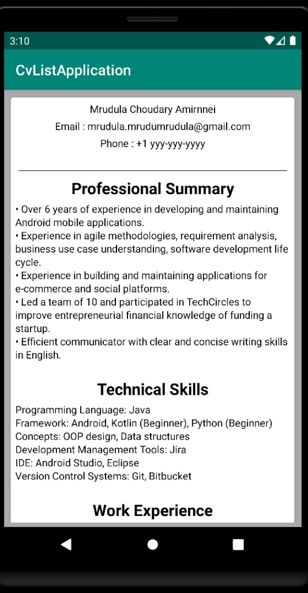
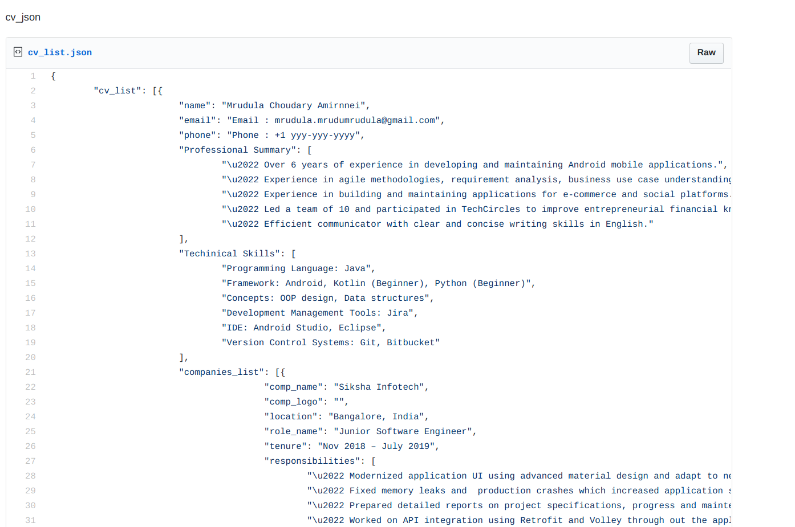
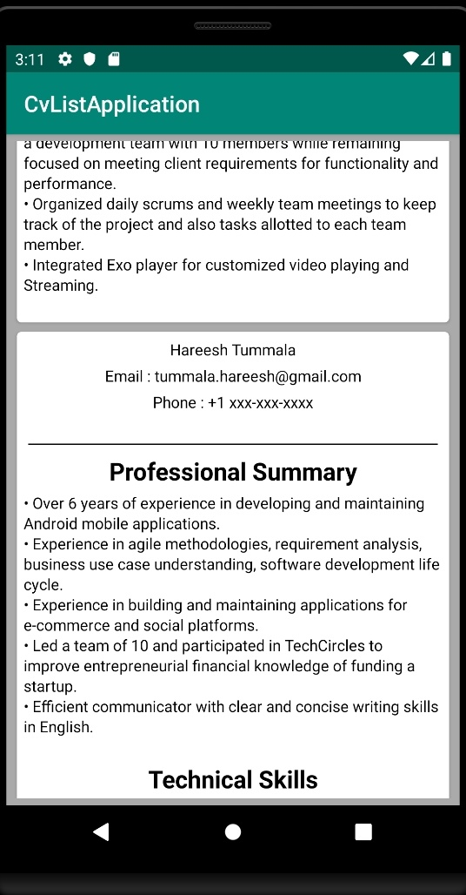

# MyCvApplicationKotlin

A Demo application which fetches Json stub from a public gist and renders the JSON into UI which resembles a person's CV.

In this project a piublic gist located at https://gist.github.com/mrudulamrudu/8f2fc3d93dad42892ef38d54eec4d163 is used as a data source.

 Cardview is used to distinguish between the recyclerview itels easily.
 
 
